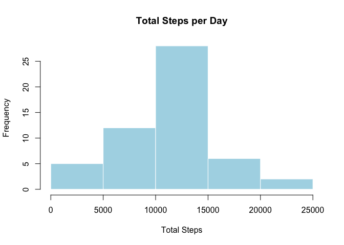
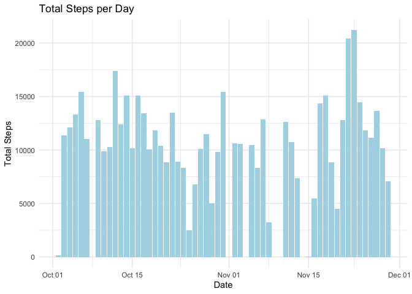
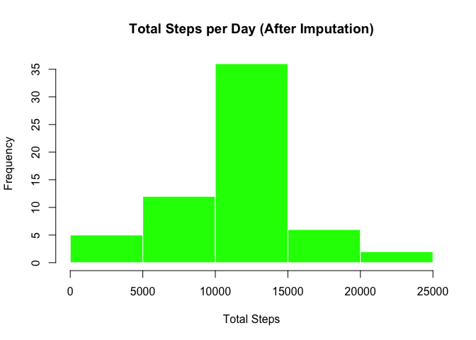
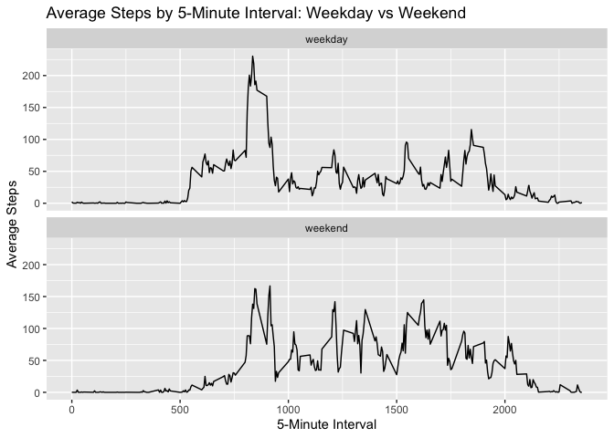

## Loading and preprocessing the data

``` r
activity_data <- read.csv("activity.csv", stringsAsFactors = FALSE)
activity_data$date <- as.Date(activity_data$date) 
```


## What is mean total number of steps taken per day?

**1.  Calculate the total number of steps taken per day**  


``` r
steps_by_day <- activity_data %>%
  group_by(date) %>%
  summarise(total_steps = sum(steps, na.rm = TRUE)) %>%
  filter(total_steps > 0)
summary(steps_by_day)
```

```
##       date             total_steps   
##  Min.   :2012-10-02   Min.   :   41  
##  1st Qu.:2012-10-16   1st Qu.: 8841  
##  Median :2012-10-29   Median :10765  
##  Mean   :2012-10-30   Mean   :10766  
##  3rd Qu.:2012-11-16   3rd Qu.:13294  
##  Max.   :2012-11-29   Max.   :21194
```

**2. Histogram of the total number of steps taken each day**

``` r
hist(steps_by_day$total_steps,
     main = "Total Steps per Day",
     xlab = "Total Steps",
     col = "lightblue",
     border = "white")
```

<!-- -->
  
**3. Calculate and report the mean and median of the total number of steps taken per day**  
  
The **mean** total number of steps taken per day is
10766
and the **median** is
10765.


## What is the average daily activity pattern?

**1.  Make a time series plot (i.e. type = "l"type = "l"start color red, start verbatim, type = "l", end verbatim, end color red) of the 5-minute interval (x-axis) and the average number of steps taken, averaged across all days (y-axis)**

``` r
library(ggplot2)
ggplot(steps_by_day, aes(x = date, y = total_steps)) +
  geom_col(fill = "lightblue") +
  labs(title = "Total Steps per Day",
       x = "Date", y = "Total Steps") +
  theme_minimal()
```

<!-- -->
  
**2.  Which 5-minute interval, on average across all the days in the dataset, contains the maximum number of steps?**


``` r
avg_by_interval <- activity_data %>%
  group_by(interval) %>%
  summarise(avg_steps = mean(steps, na.rm = TRUE))

max_avg_internal <- avg_by_interval %>%
  filter(avg_steps == max(avg_steps))
```

The 5-minute interval with the max number of steps is 835 with 206.1698113 steps


## Imputing missing values


``` r
total_NA <- total_NA <- sum(is.na(activity_data$steps))
```
The total numbers of NA values in the data set is 2304

**Compute mean steps per interval**

``` r
interval_means <- activity_data %>%
  group_by(interval) %>%
  summarise(mean_steps = mean(steps, na.rm = TRUE))
```

**Join back to original and replace NAs**

``` r
activity_filled <- activity_data %>%
  left_join(interval_means, by = "interval") %>%
  mutate(steps = ifelse(is.na(steps), mean_steps, steps)) %>%
  select(-mean_steps)
```

**Histogram of total steps per day (imputed dataset)**

``` r
steps_by_day_filled <- activity_filled %>%
  group_by(date) %>%
  summarise(total_steps = sum(steps))

hist(steps_by_day_filled$total_steps,
     main = "Total Steps per Day (After Imputation)",
     xlab = "Total Steps",
     col = "green",
     border = "white")
```

<!-- -->

``` r
mean_filled <- mean(steps_by_day_filled$total_steps)
median_filled <- median(steps_by_day_filled$total_steps)
```

After imputing missing values, the mean total steps per day is 
10766 and the median is 10766.

## Are there differences in activity patterns between weekdays and weekends?

**New factor variable with "weekdays" and "weekends"**

``` r
activity_wd_we <- activity_filled %>%
  mutate(
    dayname = weekdays(date),
    daytype = ifelse(weekdays(date) %in% c("Saturday", "Sunday"),
                     "weekend", "weekday")
  ) %>%
  mutate(daytype = factor(daytype, levels = c("weekday", "weekend"))) %>%
  select(-dayname)
```

**Time series plot**

``` r
avg_by_interval_daytype <- activity_wd_we %>%
  group_by(daytype, interval) %>%
  summarise(avg_steps = mean(steps))
```

```
## `summarise()` has grouped output by 'daytype'. You can override using the
## `.groups` argument.
```

``` r
ggplot(avg_by_interval_daytype, aes(x = interval, y = avg_steps)) +
  geom_line() +
  facet_wrap(~ daytype, ncol = 1) +
  labs(
    title = "Average Steps by 5-Minute Interval: Weekday vs Weekend",
    x = "5-Minute Interval",
    y = "Average Steps"
  )
```

<!-- -->
